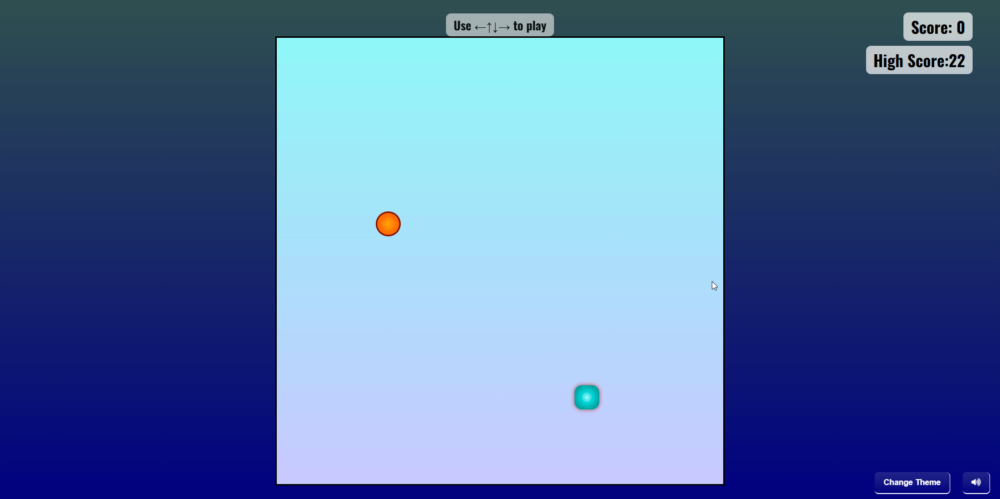

# 🐍 Snake Game

**Snake Game** is a modern rendition of the classic arcade game. Navigate the snake to consume food, grow longer, and avoid collisions with walls or yourself. Enhanced with sound effects and a sleek UI, this game offers an engaging experience for players of all ages.

## 🎮 Features

- ✅ **Classic Gameplay**: Guide the snake to eat food and grow longer.
- 🎧 **Sound Effects**: Includes background music and effects for movement, eating, and collisions.
- 🚀 **Difficulty Increases as Snake Grows**: Snake speed dynamically scales as you get longer.
- 🖼️ **Changeable Background Themes**: Choose from 3 unique looks:
  - 🌿 *Jungle* – green and natural
  - 💙 *Future Blue* – modern, neon-blue
  - 🏜️ *Desert Yellow* – dry, warm tones
- 📱 **Responsive Design**: Optimized for various screen sizes.
- 🐍 **Custom Snake Graphics**: Uses a pixelated snake sprite for retro aesthetic.


## 🎬 Demo




## 🛠️ Technologies Used

- **HTML5**: Structure of the web pages.
- **CSS3**: Styling and layout.
- **JavaScript (ES6)**: Game logic and interactivity.


## 🚀 Getting Started

To run the game locally:

1. **Clone the repository**:
   ```bash
   git clone https://github.com/arijitkayal-gm/Snakegame.git


